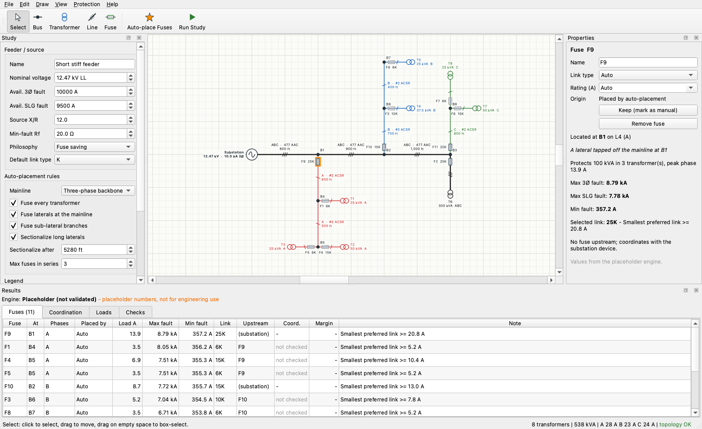

# dist-fuse-calculator

This is a prototype design-assist tool that sizes, places, and coordinates overcurrent fuses on a radial medium-voltage distribution feeder. It is the ECE 6320 term project by Gabriel Chamon and Micheal Elrod-Mocek.

You draw the feeder as a one-line diagram. The tool proposes fuse locations, sends the drawing to a protection engine (fault study, link selection, coordination checks), and color-codes the result on the diagram.



> **Status:** the GUI, the topology checks, load roll-up, and fuse placement all work. The protection engine is still a **placeholder**. Its fault currents use one generic line impedance, it sizes links with a bare 150%-of-load rule, and it reports every coordination pair as "not checked". See [Protection engine](#protection-engine).

---

## Getting started

You need Python 3.10 or newer (`python3 --version`) and git.

### macOS / Linux

```bash
git clone https://github.com/MichealElrodMocek/dist-fuse-calculator.git
cd dist-fuse-calculator
python3 -m venv .venv
source .venv/bin/activate
pip install -r requirements.txt
```

### Windows (PowerShell)

```powershell
git clone https://github.com/MichealElrodMocek/dist-fuse-calculator.git
cd dist-fuse-calculator
py -m venv .venv
.venv\Scripts\Activate.ps1
pip install -r requirements.txt
```

`requirements.txt` installs PySide6 and pytest. It also installs this repo in editable mode (`pip install -e .`), so any change you make to the source takes effect on the next run without reinstalling.

### Run it

```bash
fusecalc                                  # empty feeder
fusecalc examples/heavily_branched.json   # open a file
python -m fusecalc                        # same thing without the console script
```

You can also open the three validation feeders from **File → Open Example**.

### Run the tests

```bash
pytest
```

The GUI tests run headless (`QT_QPA_PLATFORM=offscreen` is set in `tests/conftest.py`), so they also work over SSH or in CI.

Each new terminal needs the venv activated again (`source .venv/bin/activate`, or `.venv\Scripts\Activate.ps1` on Windows). If `fusecalc` reports "command not found", the venv isn't active.

---

## Using the editor

| Tool | Key | What it does |
|---|---|---|
| Select | `V` / `Esc` | Click to select. Drag to move (snaps to the grid). Drag on empty space to box-select. `Delete` removes the selection. |
| Bus | `B` | Places a junction or pole. If exactly one node is selected, the new bus is wired to it. |
| Transformer | `T` | Places a distribution transformer. If a bus is selected, the transformer is wired to it on the **least-loaded phase available there**. |
| Line | `L` | Click a node to start. Click another node to connect to it, or click empty space to drop a new bus and keep drawing. `Esc` or right-click stops. |
| Fuse | `F` | Click a line to add or remove a fuse at its upstream end. |

Other controls:

- **Properties** (right panel): edit whatever is selected, such as phases, length, conductor, kVA, link type or rating, and the "never fuse here" flag. It also shows the computed load, fault currents, and coordination status.
- **Study** (left panel): feeder voltage, available 3Ø/SLG fault current, source X/R, minimum-fault resistance, protection philosophy, and the auto-placement rules.
- **Results** (bottom panel): tables of fuses, coordination pairs, per-segment phase loads and imbalance, and topology checks. Click a row to jump to that element.
- **Protection → Auto-place Fuses** (`Ctrl+Shift+A`): shows the proposed fuses, highlighted on the diagram, and applies the ones you leave ticked.
- **Run Study** (`F5`): re-runs the engine. It runs automatically after every edit unless you turn that off in the Protection menu.
- Undo/redo, save/open (`.json`), and **File → Export Image** (PNG) work as you'd expect.
- Zoom with `Ctrl`/`Cmd` + scroll wheel or a trackpad pinch. Pan with a normal scroll or a middle-drag. `Ctrl+0` fits the whole feeder.

### Phase notation (one-line instead of three-line)

Utility practice is to draw distribution circuits as single-line diagrams or circuit maps and to label the phasing. Three-line diagrams are generally kept for substation and relaying detail. The editor follows the usual drafting conventions:

- **Line weight and color:** three-phase lines are heavy black. Two-phase lines are brown. Single-phase taps are thin and drawn in the color of their phase (A red, B blue, C green).
- **Tick marks:** each line has one slash per phase conductor at its midpoint: `///` for ABC, `//` for AB, and `/` for a single phase.
- **Labels:** each segment is labeled with its phases, conductor, and length (for example `ABC · 477 AAC · 1,500 ft`). Each transformer shows its kVA and connection (`25 kVA B`, `50 kVA BC`, `300 kVA ABC`), and each fuse shows its link (`F3 25K`).

No single industry standard exists for phase colors; each utility picks its own. To change them, edit `PHASE_COLORS` in [fusecalc/gui/style.py](fusecalc/gui/style.py).

The Checks tab enforces phase consistency. A tap can only carry phases its supply has (a B-phase tap can't hang off an A-only lateral), and a transformer's connection must be available on the line that feeds it.

### Fuse placement rules

[fusecalc/placement.py](fusecalc/placement.py) proposes fuses in this priority order:

1. **Transformer:** every distribution transformer gets a primary cutout.
2. **Lateral:** every branch leaving the mainline is fused at the tap.
3. **Sub-lateral:** where a lateral splits, the side branches are fused. The branch carrying the most load continues as the lateral.
4. **Sectionalizing:** a long lateral gets another fuse once the line past the last fuse exceeds a set length (1 mile by default).

The mainline is left to the substation breaker or recloser. Two definitions of the mainline are available: every three-phase line reachable through three-phase line, or the single heaviest-load path from the source. A candidate fuse is skipped if it would put more than **N fuses in series** between the source and any transformer (default 3).

Fuses you place by hand, or edit, are always kept. Fuses from an earlier auto-placement are replaced each time placement runs. Segments marked "never auto-place a fuse here" are skipped.

---

## Project layout

```
fusecalc/
  model.py            Feeder data model + JSON save/load (no Qt)
  topology.py         Radial tree from the source, validation, per-phase load roll-up,
                      protecting/protected fuse pairs
  placement.py        Rule-based fuse placement
  library.py          Conductor library loader (data/conductors.json)
  engine/
    api.py            ** Contract between the GUI and the protection engine **
    placeholder.py    Stand-in engine (replace me)
    __init__.py       default_engine(): the engine the GUI runs
  gui/                PySide6 one-line editor (the only package that imports Qt)
examples/             Validation feeders: short stiff, long weak tap, heavily branched
tests/                pytest suite, including engine-contract and headless GUI tests
```

Nothing outside `fusecalc/gui/` imports Qt, so you can develop and test the model, the placement rules, and the engine without a display.

---

## Protection engine

This is the part Gabriel owns. The GUI only calls:

```python
from fusecalc.engine import default_engine, build_context

results = default_engine().run(build_context(feeder))
```

**What the engine gets** is a `StudyContext` ([fusecalc/engine/api.py](fusecalc/engine/api.py)). The topology is already worked out:

| Field | Meaning |
|---|---|
| `ctx.feeder` | The model: `feeder.settings` (kV, available fault current, X/R, Rf, philosophy, preferred link type), `feeder.nodes`, `feeder.segments` (length, conductor, phases, fuse) |
| `ctx.tree` | The radial tree. `tree.order` lists nodes from the source outward, `tree.segment_order()` lists segments parents-first, and `tree.upstream[seg]` / `tree.downstream[seg]` give each segment's ends. The fuse on a segment sits at `tree.upstream[seg]`. |
| `ctx.loads[seg]` | Connected load downstream of a segment: `kva` and `amps` per phase, `max_amps`, `transformer_count` |
| `ctx.pairs` | `CoordinationPair(protecting_fuse, protected_fuse, …)`: each fuse paired with the nearest fuse upstream of it |
| `ctx.issues` | Topology errors and warnings; `ctx.has_errors` is True if any are errors |

**What it returns** is a `StudyResults`:

- `faults[node_id] = NodeFault(i3ph_a, islg_a, imin_a)` for every node in `tree.order`
- `links[fuse_id] = LinkSelection(link_type, rating_a, load_a, ok, note)` for every fuse. If the user fixed a type or rating on the fuse (`fuse.link_type` / `fuse.rating_a` not `None`), keep it.
- `coordination = [CoordinationResult(protecting_fuse, protected_fuse, fault_current_a, limit_a, status, note)]`, one entry per pair. `status` is `"pass"`, `"fail"` or `"not_checked"`. The GUI computes the margin as `limit_a - fault_current_a` and colors each fuse by its status.
- `messages`: free text that appears in the Checks tab

**To plug in the real engine:**

1. Write a class with a `name` attribute and a `run(ctx) -> StudyResults` method, for example in `fusecalc/engine/protection.py`. Look at `placeholder.py` for a skeleton.
2. Return an instance of it from `default_engine()` in [fusecalc/engine/__init__.py](fusecalc/engine/__init__.py).
3. Run `pytest tests/test_engine_contract.py`. It checks that every node and fuse gets a result, that the engine doesn't modify the feeder, and that the coordination pairs match.

If the engine raises an exception, the GUI keeps running and shows the traceback in the Checks tab.

**Data still to fill in:**

- The sequence impedances in [fusecalc/data/conductors.json](fusecalc/data/conductors.json) (`r1, x1, r0, x0` in Ω/mile) are `null`. They depend on the pole-top spacing you assume, so take them from Kersting or manufacturer data.
- EEI-NEMA K/T/H/N link ratings and the manufacturer coordination tables (maximum coordinating current for each protecting/protected pair).

---

## Open items

- [ ] Real fault study, link selection, and coordination tables (engine)
- [ ] Phase-balancing optimizer that suggests transformer phase moves. The Loads tab already shows per-phase current and imbalance.
- [ ] Use the fuse-saving / fuse-blowing philosophy against the upstream recloser (the setting is already in the file format)
- [ ] Validation write-up on the three example feeders

## File format

Feeders are saved as plain JSON: settings, placement policy, nodes (with `kind`, `x`, `y`), and segments (each with an optional `fuse`). Unknown keys are ignored when a file is loaded, so adding fields later won't break old files.
